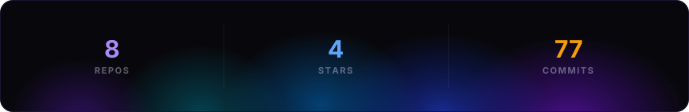
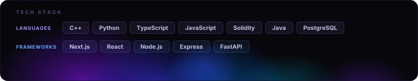

 
<h1 align="center">Hi there, I'm Arpit Doshi.</h1>

<!-- Typing Animation -->

  

  Building high-performance backend architectures, low-latency financial systems, and secure decentralized protocols. Welcome to my GitHub!

***

### About Me 💻

* 🔭 I’m currently learning **Systems Programming, Low-Latency Architecture, and Concurrency**
* 🤝 I’m looking to collaborate on **High-Performance Backend Systems, Tooling, and Web3 Protocols**
* 💬 Ask me about **C++, Python, Solidity, and System Orchestration**
* ✉️ How to reach me: **arpitrajeshdoshi@gmail.com**

***

### Featured Projects 🚀

* **[LOB-Sim](https://github.com/Arpit-R-Doshi/LOB-Sim)**: A deterministic matching engine built in C++20 executing order matching with price-time (FIFO) priority. Features a custom vector-backed Object Pool allocator to bypass runtime dynamic heap allocations.
* **[DeFi Risk Simulation Lab](https://github.com/Arpit-R-Doshi/DeFi-Simulation-Lab)**: An agent-based simulation engine (Mesa ABM) modeling 7 DeFi archetypes executing adversarial strategies to surface liquidity and oracle risks, with real-time streaming via FastAPI WebSockets.

***

### Recent Wins & Achievements 🏆

* 🥇 **First Prize** - IIT Delhi Yellow x BizThon ($5000) as a Smart Contract Developer.
* 🥈 **Runner Up** - HackSync 2 (Blockchain domain) TSEC, as a Smart Contract & Backend Developer.
* 🥉 **Second Runner Up** - CSI SPIT Hackathon'26 (Rs. 25,000) as a Blockchain Developer.
* 🥈 **Runner Up** - SIES Bytecamp'26 (Rs. 30,000) as a Blockchain and Backend Developer.

***

### Languages & Tech Stack 🛠️

**Programming Languages**   

**Backend, Frameworks & Web3**         

**Databases, DevOps & Systems**     

<!-- Custom badges for modern data tools used in your SDE internship -->

   

***

  

 

𝗉𝗈𝗐𝖾𝗋𝖾𝖽 𝖻𝗒 <a href="https://github.com/collectioneur/readme-aura">𝗋𝖾𝖺𝖽𝗆𝖾-𝖺𝗎𝗋𝖺</a>

