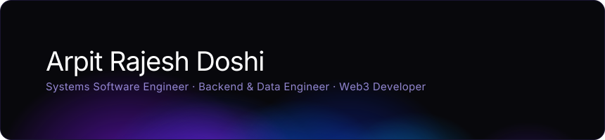
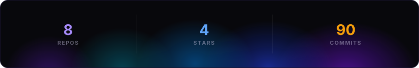
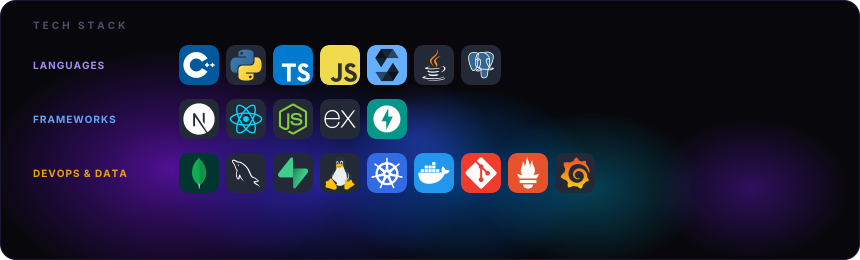

<br>


<br>

<p align="center">
  <a href="https://linkedin.com/in/arpitrajeshdoshi">
```aura width=130 height=45
(function() {
  return (
    <div style={{
      width: '100%', height: '100%', background: '#000000',
      display: 'flex', alignItems: 'center', justifyContent: 'center', gap: 8,
      fontFamily: 'Manrope', borderRadius: 30, border: '1px solid rgba(0, 119, 181, 0.8)',
      position: 'relative', overflow: 'hidden'
    }}>
      <svg width="100%" height="100%" style={{ position: 'absolute', top: 0, left: 0 }}>
        <defs>
          <radialGradient id="g-in" cx="50%" cy="50%" r="50%">
            <stop offset="0%" stopColor="rgba(0,119,181,0.5)" />
            <stop offset="100%" stopColor="rgba(0,119,181,0)" />
          </radialGradient>
        </defs>
        <ellipse cx="20%" cy="50%" rx="60%" ry="80%" fill="url(#g-in)" />
        <ellipse cx="80%" cy="50%" rx="60%" ry="80%" fill="url(#g-in)" />
      </svg>
      <div style={{ display: 'flex', alignItems: 'center', gap: 8, zIndex: 10 }}>
        
        <div style={{ color: '#ffffff', fontSize: 14, fontWeight: 700, letterSpacing: '0.5px' }}>LinkedIn</div>
      </div>
    </div>
  );
})()
```
  </a>
  &nbsp;&nbsp;
  <a href="mailto:arpitrajeshdoshi@gmail.com">
```aura width=120 height=45
(function() {
  return (
    <div style={{
      width: '100%', height: '100%', background: '#000000',
      display: 'flex', alignItems: 'center', justifyContent: 'center', gap: 8,
      fontFamily: 'Manrope', borderRadius: 30, border: '1px solid rgba(234, 67, 53, 0.8)',
      position: 'relative', overflow: 'hidden'
    }}>
      <svg width="100%" height="100%" style={{ position: 'absolute', top: 0, left: 0 }}>
        <defs>
          <radialGradient id="g-mail" cx="50%" cy="50%" r="50%">
            <stop offset="0%" stopColor="rgba(234,67,53,0.5)" />
            <stop offset="100%" stopColor="rgba(234,67,53,0)" />
          </radialGradient>
        </defs>
        <ellipse cx="20%" cy="50%" rx="60%" ry="80%" fill="url(#g-mail)" />
        <ellipse cx="80%" cy="50%" rx="60%" ry="80%" fill="url(#g-mail)" />
      </svg>
      <div style={{ display: 'flex', alignItems: 'center', gap: 8, zIndex: 10 }}>
        
        <div style={{ color: '#ffffff', fontSize: 14, fontWeight: 700, letterSpacing: '0.5px' }}>Email</div>
      </div>
    </div>
  );
})()
```
  </a>
</p>

<br>
<p align="center"><sub>𝗉𝗈𝗐𝖾𝗋𝖾𝖽 𝖻𝗒 <a href="https://github.com/collectioneur/readme-aura">𝗋𝖾𝖺𝖽𝗆𝖾-𝖺𝗎𝗋𝖺</a></sub></p>
